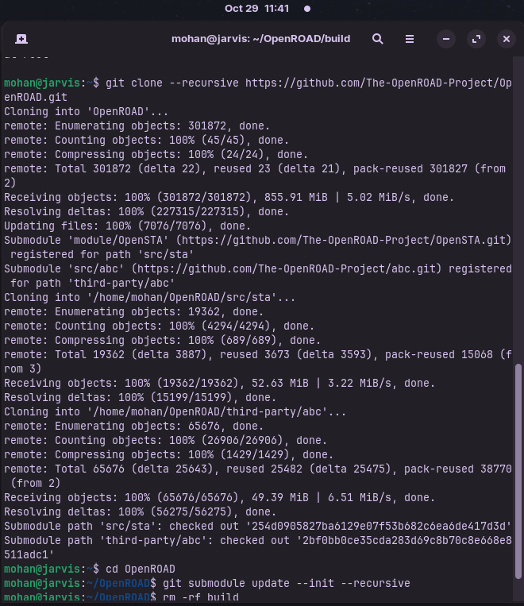

# Routing and Static Timing Analysis of GCD  

This lab focuses on using **OpenROAD Flow Scripts** to perform the **Routing** and **Static Timing Analysis (STA)** stages for the **GCD** circuit. It continues from the earlier **floorplanning** and **placement** phases, demonstrating how to complete **signal routing** and conduct **timing verification** — essential processes in the **VLSI physical design flow**.


---

## 📑 Table of Contents

1. [Introduction and Importance of Floorplanning and Placement](#introduction-and-importance-of-floorplanning-and-placement)  
2. [Installation of OpenROAD Flow](#installation-of-openroad-flow)  
3. [Part 1: Installation of OpenROAD](#-part-1-installation-of-openroad)  
4. [Part 2: Building and Running OpenROAD Flow Scripts](#️-part-2-building-and-running-openroad-flow-scripts)  
5. [Part 3: Floorplanning of GCD Design](#-part-3-floorplanning-gcd-design)  
6. [Part 4: Placement of GCD Design](#part-4-placement-of-gcd)  
7. [STA Output Includes ](#sta-output-includes)    
8. [Summary](#-summary)

---

## Introduction and Importance of Floorplanning and Placement

### Introduction
In the **VLSI physical design flow**, **floorplanning** and **placement** are critical stages that define how a circuit’s logical components are physically arranged on the chip. These stages bridge the gap between the logical design and the physical implementation, ensuring that the design is not only functional but also physically realizable and efficient.

### Importance
**Floorplanning** involves defining the **physical layout of the chip** before standard cells are placed. It includes:  

- Allocating **die and core area**.  
- Placing **I/O pads** around the die periphery.  
- Arranging **macros** (like SRAM, PLLs) strategically.  
- Dividing the core into **standard cell rows**.  
- Designing a robust **power delivery network (PDN)**.  
- Reserving areas for **physical-only cells** (tap cells, endcaps, blockages).  

**Placement** follows floorplanning and determines the exact locations of **standard cells and small blocks** within the defined core. The main goals are:  

- **Minimize wire length** between connected cells.  
- **Reduce congestion** to ease the routing process.  
- **Meet timing constraints** to ensure reliable circuit operation.  

Together, these steps play a key role in optimizing **chip area, performance, and power efficiency**, setting a strong foundation for later stages like routing and timing analysis.


## Installation of OpenROAD Flow

Before setting up **OpenROAD Flow Scripts**, ensure the following requirements are met:

- **Operating System:** Ubuntu 20.04 or later (preferably Ubuntu 22.04)  
  *(I’m using `Zorin OS`, which is based on Ubuntu 22.04.)*
- **Git:** Required for cloning repositories.
- **Build Tools:** Includes CMake, GCC/G++, Make, and standard development libraries needed for compiling the flow.
- **Python 3:** Version 3.6 or higher is recommended.
- **EDA Tools:**
  - **OpenROAD** – for placement and routing.
  - **Yosys** – for logic synthesis.
  - **OpenSTA** – for static timing analysis.

---

### Essential OpenROAD Dependencies (for Ubuntu/Zorin OS)

```bash
sudo apt install build-essential cmake git python3-dev python3-pip swig tcl-dev libreadline-dev libboost-all-dev libeigen3-dev zlib1g-dev flex bison libspdlog-dev libtbb-dev libyaml-cpp-dev libcudd-dev qt5-default qtbase5-dev qttools5-dev-tools qttools5-dev libqt5opengl5-dev libgsl-dev libffi-dev libgoogle-perftools-dev libncurses5-dev libncursesw5-dev libx11-dev libxrender-dev libxext-dev pkg-config ninja-build gdb clang-format valgrind -y
```


# OpenROAD Installation and Flow Setup Guide

This guide provides detailed steps to **install OpenROAD**, **set up OpenROAD Flow Scripts**, and **run a complete flow (floorplan, placement, and STA)** for the `gcd` design using the **Sky130 PDK**.  
It is formatted and optimized for professional GitHub documentation.

---

## 🧩 Part 1: Installation of OpenROAD

### Step 1: Install OR-Tools

OpenROAD depends on Google’s OR-Tools for optimization tasks. Install it using the following commands:

```bash
git clone https://github.com/google/or-tools.git  
cd or-tools  
```

Then, configure the build

```bash
cmake -S . -B build -DBUILD_DEPS=ON  
```

And install the `or-tools` using,

```bash
cmake --build build --config Release --target install -v  
```

---

### Step 2: Clone and Set Up OpenROAD

Clone the official OpenROAD repository and initialize submodules.

```bash
git clone --recursive https://github.com/The-OpenROAD-Project/OpenROAD.git  
cd OpenROAD  
git submodule update --init --recursive  
```



---

### Step 3: Build GTest (Required Dependency)

Ubuntu doesn’t include precompiled GTest libraries, so build them manually:

```bash
cd /usr/src/gtest  
sudo env "PATH=$PATH" cmake .  
sudo make  
sudo cp lib/*.a /usr/lib  

This creates:  
/usr/lib/libgtest.a  
/usr/lib/libgtest_main.a  
```

---

### Step 4: Configure CMake Build

If you already configured before, clean the cache to start fresh:

```bash
cd ~/OpenROAD/build  
rm -f CMakeCache.txt  
rm -rf CMakeFiles  
```

Then configure with GUI support enabled:

```bash
cmake .. -DENABLE_GUI=ON -DQt5_DIR=/usr/lib/x86_64-linux-gnu/cmake/Qt5  
```

If configured correctly, you’ll see:

```lua
-- Found Qt5Core  
-- Found Qt5Widgets  
-- Found Qt5Gui  
-- Configuring done  
-- Generating done  
-- Build files have been written to: /home/mohan/OpenROAD/build  
```

---

### Step 5: Build OpenROAD

Use all CPU cores for faster compilation:

```bash
make -j$(nproc) 
``` 

> [!Note]
> This process may take more than an hour and will generate significant CPU load.

To check it run:

```bash
cd ..
openroad
```
see something like :


---

## ⚙️ Part 2: Building and Running OpenROAD Flow Scripts

Once OpenROAD is built, proceed to install and run **OpenROAD Flow Scripts**, which automate synthesis, floorplanning, placement, routing, and timing analysis.

---

### Step 1: Clone Flow Scripts Repository

```bash
cd ~  
git clone --recursive https://github.com/The-OpenROAD-Project/OpenROAD-flow-scripts.git  
```


> [!Note] The `--recursive` flag ensures that submodules like `tools/OpenROAD`, `tools/yosys`, and `tools/magic` are fetched automatically.  

If you forgot to use `--recursive`, run:

```bash
cd ~/OpenROAD-flow-scripts  
git submodule update --init --recursive  
```

---

### Step 2: Install Dependencies

Install all required tools and libraries:

```bash
sudo apt update  
sudo apt install python3 python3-pip build-essential cmake git magic klayout \
tcl-dev tk-dev bison flex libreadline-dev zlib1g-dev gawk libcudd-dev graphviz  
```

These cover:

- **Math Libraries:** OpenBLAS, LAPACK, GSL  
- **Graphics:** libpng, libjpeg, Qt5-SVG  
- **Logic Tools:** CUDD, Yosys  
- **System Libraries:** YAML, Zstd, Tcl/Tk, SQLite3  

---

### Step 3: Navigate to the flow scripts folder 

```bash
cd ~/OpenROAD-flow-scripts  
cd flow
```

---

### Step 4: Map Installed Tools

Set environment variables for your installed tool paths:

```bash
export OPENROAD_EXE=/usr/local/bin/openroad  
export YOSYS_EXE=~/Documents/Apps/oss-cad-suite/bin/yosys  
export OPENSTA_EXE=/usr/local/bin/sta  
```

> [!Tip:] 
> Use the `whereis` command to locate binaries for
OpenROAD, Yosys, and OpenSTA.

---

## 🧱 Part 3: Floorplanning `gcd` Design

Run the floorplan stage for the `gcd` design:

```bash
make DESIGN_CONFIG=./designs/sky130hd/gcd/config.mk floorplan  
```


To visualize the floorplan in GUI:

```bash
make DESIGN_CONFIG=./designs/sky130hd/gcd/config.mk gui_floorplan  
```


The floorplan defines **core area**, **IO pin placement**, and **macro/block distribution**.

---

## Part 4: Placement of `gcd`

Run placement for the design:

```bash
make DESIGN_CONFIG=./designs/sky130hd/gcd/config.mk place  
```


To view placement in GUI:

```bash
make DESIGN_CONFIG=./designs/sky130hd/gcd/config.mk gui_place  
```


Placement ensures standard cells are positioned efficiently to minimize wirelength and timing delays.

---


### STA Output Includes:

- **Worst Negative Slack (WNS)** – most critical timing violation  
- **Total Negative Slack (TNS)** – sum of all violations  
- **Path Delay Reports** – shows delays of critical timing paths  
- **Setup and Hold Margins** – evaluates timing safety  

---


## 🧾 Summary

This documentation provides a **complete walkthrough** of the **OpenROAD flow** from installation to floorplanning, placement, and static timing analysis for the **GCD (Greatest Common Divisor)** module using the **Sky130 PDK**.

### Key Learnings
- **Floorplanning:**  
  Defined die area, core boundaries, I/O pin placement, and macro organization.  
  Established a foundation for an efficient physical layout and ensured power network planning.  

- **Placement:**  
  Positioned standard cells optimally to minimize wirelength, reduce congestion, and satisfy timing constraints.  

- **Static Timing Analysis (STA):**  
  Used **OpenSTA** to analyze critical timing paths, measure **WNS** and **TNS**, and verify design meets setup and hold requirements.

### Achievements
- Successfully set up and compiled **OpenROAD** and **OpenROAD Flow Scripts**.  
- Performed **floorplanning** and **placement** using the Sky130 PDK.  
- Verified post-placement timing through **OpenSTA**.  
- Gained practical exposure to key **VLSI backend design stages**.

### Next Steps
The next logical stages after this experiment are:
- **Routing (Global and Detailed)**  
- **Design Rule Checking (DRC)** and **Layout vs. Schematic (LVS)** verification  
- **Power and IR-drop analysis**  
- **Clock Tree Synthesis (CTS)**  

This marks a major milestone in understanding and executing the **VLSI Physical Design Flow**, transforming the logical GCD module into a **physically realized, timing-verified layout** ready for chip fabrication.
